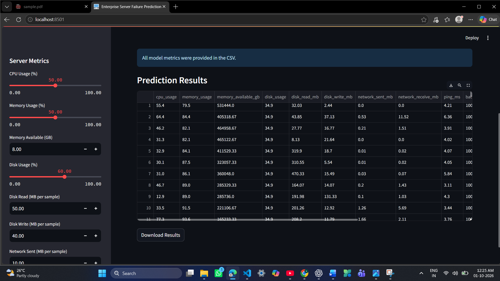

# Prediction Enterprise Server Failure 

A Machine Learning-based application that monitors server/system performance metrics and predicts potential server failure risk using XGBoost.

The project uses Psutil for system metric collection and Streamlit to provide an interactive prediction dashboard.

#  Objective

The main objective is to analyze server performance data and identify conditions that may be associated with server failure.

This can help provide an early warning mechanism for potential infrastructure problems.

# Key Features

 Collects system performance metrics using Psutil

 Monitors CPU, memory, disk, network, latency, and running processes

 Uses XGBoost for server failure classification

 Provides failure probability

 Displays server health status

 Shows feature importance

 Supports CSV batch prediction

 Allows prediction results to be downloaded

 Provides an interactive Streamlit dashboard

 Saves the trained model using Joblib

# Project Workflow

```text
System Metrics
      ↓
Data Collection
      ↓
Data Preprocessing
      ↓
Feature Preparation
      ↓
XGBoost Model
      ↓
Model Evaluation
      ↓
Saved Model
      ↓
Streamlit Dashboard
      ↓
Server Failure Prediction
```

# Machine Learning

The project uses XGBoost Classifier for binary classification.

text
0 → Healthy / No Failure
1 → Failure Risk


The model can also provide the probability of failure using `predict_proba()`.

Model evaluation includes:

 Accuracy

 Precision

 Recall

 F1 Score

 Confusion Matrix

 ROC-AUC

# Main Input Features

The application works with infrastructure-related metrics such as:

 CPU Usage

 Memory Usage

 Available Memory

 Disk Usage

 Disk Read/Write

 Network Sent/Received

 Network Latency

 Running Processes

 Battery Percentage

 Temperature

 Error Logs

 Application Crash Logs

 Maintenance History
 
 Date and Time Features

# Streamlit Dashboard

The dashboard provides:

  Manual server metric input

  Failure prediction

  Failure probability

  Current server metrics

  Feature importance

  Batch CSV prediction

  Downloadable prediction results

# Project Structure

---text
Enterprise-Server-Failure-Prediction/
│
├── app.py
├── collector.py
├── train_model.py
├── server_failure_model.pkl
├── system_working_performance_dataset.csv
├── requirements.txt
├── .gitignore
└── README.md


# File Description

| File                                     | Description                       |
| ---------------------------------------- | --------------------------------- |
|  aap.py                                  | Streamlit application             |
|  data_collection.py                            | Collects system performance data  |
|  data_model.ipynb                          | Trains and evaluates the ML model |
|  server_failure_model.pkl                | Saved trained model               |
|  system_working_performance_dataset.csv  | Performance dataset               |
|  requirements.txt                        | Project dependencies              |
|  gitignore                               | Git ignored files                 |

# Technology Stack

  Python – Programming language
  Pandas – Data processing
  NumPy – Numerical operations
  Scikit-Learn – Preprocessing and evaluation
  XGBoost– Machine Learning model
  Joblib – Model serialization
  Psutil – System monitoring
  Ping3 – Network latency
  Streamlit – Web dashboard
  Plotly / Matplotlib / Seaborn – Visualization

# Installation

# 1. Create Virtual Environment

```bash
python -m venv venv
```

# 2. Activate Environment

*Windows:

```bash
venv\Scripts\activate
```

# 3. Install Dependencies

```bash
python -m pip install -r requirements.txt
python -m streamlit run aap.py
```

#  Run the Project

# Step 1: Collect Data

```bash
python data_collection.py
```

This collects system metrics and stores them in:

```text
system_working_performance_dataset.csv
```

# Step 2: Train Model

Open `data_model.ipynb` in Jupyter and run the cells from top to bottom.

This creates:

```text
server_failure_model.pkl
```

# Step 3: Start Dashboard

```bash
python -m streamlit run aap.py
```


Dashboard Output

]))

 Output

]))


#  Batch Prediction

The application supports CSV-based batch prediction.

```text
Upload CSV
     ↓
Process Data
     ↓
Generate Predictions
     ↓
View Results
     ↓
Download CSV
```

The output contains a `Prediction` column.

# Applications

This project can be adapted for:

* Data Center Monitoring
* Cloud Infrastructure
* Enterprise IT Operations
* Application Server Monitoring
* Predictive Maintenance

# Future Improvements

* Use real historical server-failure data
* Add time-series prediction
* Integrate a database
* Build a FastAPI backend
* Deploy using Docker
* Add automated alerts
* Support multi-server monitoring

# Project Highlights

Machine Learning • XGBoost • System Monitoring • Data Preprocessing • Feature Engineering • Streamlit • Batch Prediction • Predictive Maintenance


# 
# live Link of the project:-
https://predicting-enterprise-server-failure-ybezpkbj7bgrbytfsoqguy.streamlit.app/
